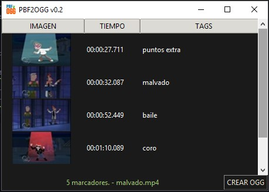

# PBF2OGG v0.2
## Funcion
crea un archivo de texto en formato OGG a partir de un archivo pbf del cual obtiene informacion de cada chapter (tiempo, titulo e imagen)



> [!INFO]
> El formato ogg para chapters o capitulos consiste en que cada capitulo o chapter de un video

cada chapter esta representando de la siguiente manera en dos lineas:
```
CHAPTER01=00:00:00.000
CHAPTER01NAME=nombre del marcador, chapter o cppitulo
```

**Librerias**
* tkinterdnd2-universal     1.7.3
* Pillow                    10.0.0

---

las imagenes de cada marcador estan en formato hexadecimal y existe una parte que no se que signifique (no se si sera la cabecera de la imagen con metadata o algo para programa) descontando esa parte se obtiene toda la informacion del archivo con extension **.pbf**

la imagen es de muy poca resolusion 72x40 descontando los bordes negros que tiene (se entiende por que esta codificada en hexadecimal como texto para que no sea demasiado extenso y el archivo pbf pese mas)
por lo que el programa muestra la imagen con esa resolusion 72x40

existe una version mas simple que cumple la misma funcion, sin la imagen del marcador en: https://github.com/keinc0de/pbf2ogg_v0.1
